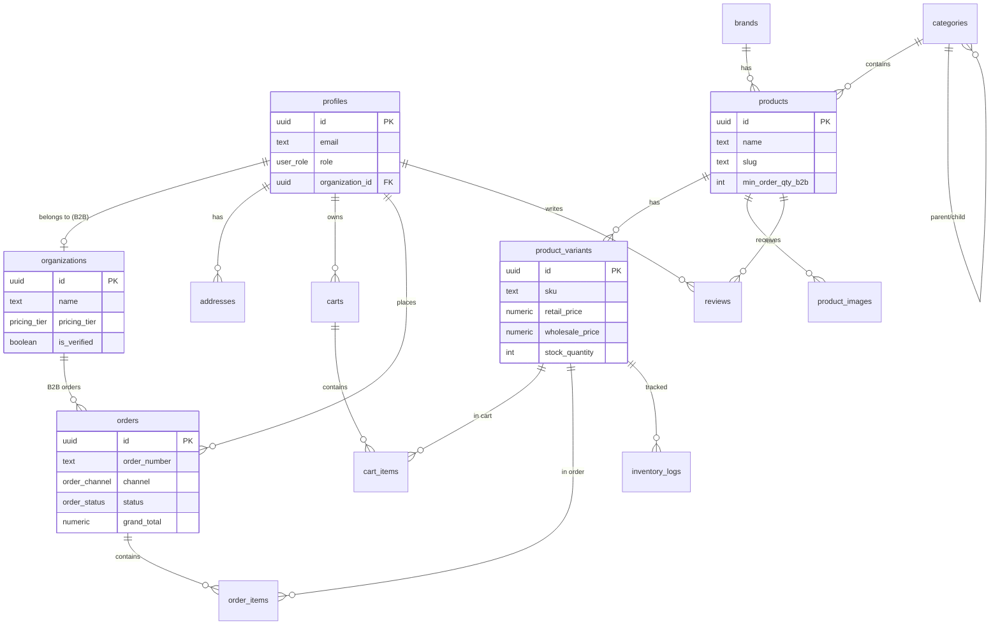

# Phase 1 — K-Beauty Shop 기획 및 스캐폴드

> **상태:** Phase 1 완료 (스캐폴드 + DB 설계)  
> **다음 단계:** Phase 2 — Supabase 연동, UI 구현, 결제

## 1. 프로젝트 개요

K-Beauty Shop은 한국 화장품(스킨케어·메이크업)을 **B2C(소매)** 와 **B2B(도매)** 로 판매하는 이커머스 플랫폼입니다.

Phase 1에서는 다음을 완료합니다.

- Next.js App Router 기반 **폴더 구조 및 라우트 스캐폴드**
- **Supabase PostgreSQL 스키마** 설계 (RLS 주석 포함)
- TypeScript **타입 플레이스홀더** (`src/types/database.ts`)
- Phase 2 이후 작업 범위 정의

### UX 참고 (영감만, 복제 아님)

[Q-Depot](https://www.q-depot.com/) 같은 K-Beauty 수출·도매 플랫폼의 정보 구조를 **참고**합니다.

| 영역 | 참고 UX 패턴 | 본 프로젝트 적용 |
|------|-------------|-----------------|
| 홈 | 브랜드·카테고리 진입, 프로모션 배너 | `/` — 추천 상품·카테고리 허브 (Phase 2) |
| 카탈로그 | 카테고리 필터, 브랜드별 탐색 | `/categories`, `/products` |
| 상품 상세 | 성분·용량·MOQ(도매) | `/products/[slug]` |
| B2B | 도매가·최소 주문 수량 | `organizations`, `pricing_tier` |
| 관리자 | 주문·재고·상품 CRUD | `/admin/*` |

> Q-Depot의 디자인·에셋·코드는 **복사하지 않습니다.** 자체 UI/브랜딩으로 구현합니다.

---

## 2. 폴더 구조

```
k-beauty-shop/
├── docs/
│   └── PHASE1.md                 ← 이 문서
├── supabase/
│   └── schema.sql                ← DB 스키마 (Phase 1)
├── src/
│   ├── app/
│   │   ├── layout.tsx            ← 루트 레이아웃
│   │   ├── page.tsx              ← 홈 (/)
│   │   ├── (storefront)/         ← 고객-facing 라우트 그룹
│   │   │   ├── categories/page.tsx
│   │   │   ├── products/
│   │   │   │   ├── page.tsx
│   │   │   │   └── [slug]/page.tsx
│   │   │   ├── cart/page.tsx
│   │   │   ├── checkout/page.tsx
│   │   │   └── account/page.tsx
│   │   └── (admin)/              ← 관리자 라우트 그룹
│   │       └── admin/
│   │           ├── page.tsx
│   │           ├── products/page.tsx
│   │           └── orders/page.tsx
│   ├── components/
│   │   ├── ui/                   ← 공통 UI (Phase 2)
│   │   ├── store/                ← 스토어프론트 컴포넌트
│   │   └── admin/                ← 관리자 컴포넌트
│   ├── lib/
│   │   ├── supabase/
│   │   │   ├── client.ts         ← 브라우저 클라이언트 (플레이스홀더)
│   │   │   └── server.ts         ← 서버 클라이언트 (플레이스홀더)
│   │   └── utils.ts
│   └── types/
│       └── database.ts           ← Supabase 타입 (플레이스홀더)
└── README.md
```

---

## 3. 페이지 맵

### 스토어프론트 (B2C / B2B 공통 UI, 채널은 로그인·가격 정책으로 구분)

| URL | 파일 | 설명 |
|-----|------|------|
| `/` | `src/app/page.tsx` | 홈 — 프로모션, 추천 상품 (Phase 2) |
| `/categories` | `(storefront)/categories/page.tsx` | 카테고리 목록 |
| `/products` | `(storefront)/products/page.tsx` | 상품 목록·필터 |
| `/products/[slug]` | `(storefront)/products/[slug]/page.tsx` | 상품 상세 |
| `/cart` | `(storefront)/cart/page.tsx` | 장바구니 |
| `/checkout` | `(storefront)/checkout/page.tsx` | 결제·배송 |
| `/account` | `(storefront)/account/page.tsx` | 마이페이지·주문 내역 |
| `/login` | `(storefront)/login/page.tsx` | 로그인 (Phase 2 Auth) |
| `/signup` | `(storefront)/signup/page.tsx` | 회원가입 (Phase 2 Auth) |
| `/orders/[order_number]` | `(storefront)/orders/[order_number]/page.tsx` | 주문 확인 |

### 관리자

| URL | 파일 | 설명 |
|-----|------|------|
| `/admin` | `(admin)/admin/page.tsx` | 대시보드 (매출·주문 요약) |
| `/admin/products` | `(admin)/admin/products/page.tsx` | 상품·재고 관리 |
| `/admin/orders` | `(admin)/admin/orders/page.tsx` | 주문 처리 |

---

## 4. 데이터베이스 ERD



전체 DDL: [`supabase/schema.sql`](../supabase/schema.sql)

---

## 5. Phase 2+ 예정 작업 (Phase 1 범위 외)

| Phase | 범위 |
|-------|------|
| **Phase 2** | Supabase 프로젝트 생성, Auth, RLS 정책 적용, `@supabase/supabase-js` 연동 |
| **Phase 3** | 스토어프론트 UI (헤더·푸터·상품 카드·필터), 반응형 디자인 |
| **Phase 4** | 장바구니·결제 (토스/Stripe), B2B 도매가·MOQ 로직 |
| **Phase 5** | 관리자 CRUD, 재고·주문 상태 관리, 대시보드 |
| **Phase 6** | i18n(한/영), SEO, 배포(Vercel), E2E 테스트 |

---

## 6. Phase 1 승인 및 Phase 2 진행 방법

Phase 1 산출물을 검토해 주세요.

1. **라우트 스캐폴드** — `npm run dev` 후 각 URL 접속 확인
2. **DB 스키마** — `supabase/schema.sql` ERD·테이블·RLS 주석 검토
3. **타입 정의** — `src/types/database.ts` 와 스키마 일치 여부

### 승인 방법

아래 중 하나로 회신해 주시면 Phase 2를 시작합니다.

- ✅ **"Phase 2 진행"** — Supabase 연동 및 RLS 정책 구현
- 🔄 **수정 요청** — 변경이 필요한 페이지·테이블·필드 명시
- ❌ **보류** — 추가 기획 논의

---

## 7. 로컬 실행

```bash
npm install
npm run dev
```

빌드 검증:

```bash
npm run build
```
